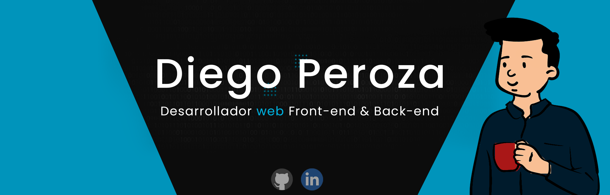

#  Hola, mi nombre es Diego Peroza 👋
### Desarrollador Full Stack - Apps, Paginas webs | Más que Código

Soy un apasionado desarrollador con más de 4 años de experiencia, comprometido con el aprendizaje continuo y la mejora constante de mis habilidades.

Mi viaje en el mundo de la programación comenzó en 2016 durante mis estudios universitarios, marcando el inicio de mi búsqueda para crecer como profesional en la industria del desarrollo de software.

En la actualidad, desempeño el rol de desarrollador en una pequeña empresa de merchandising. Mi responsabilidad principal es mantener y actualizar sus plataformas de comercio electrónico, asegurando un funcionamiento óptimo y a la vanguardia de las últimas tecnologías.

Me he especializado en el desarrollo de aplicaciones web y, durante mis tiempos libres, colaboro con empresas de diferentes partes del mundo. Mi objetivo es no solo crear software funcional, sino también soluciones que impulsen el éxito de mis clientes.

Siempre estoy abierto a nuevas oportunidades y desafíos que me permitan seguir creciendo como profesional. ¡Vamos a construir juntos el futuro del desarrollo de software! 🚀

## Tecnologías:

Y alguna más..
 

## Servicios Clouds:

 

Y alguna más...

## Bases de datos:

## Encuéntrame en:

 

## Mis guías de estudio:

#### Puedes apoyar mi trabajo haciendo "☆ Star" en el repo o nominarme a "GitHub Star". ¡Gracias!

## Contacto:

[-D14836?style=for-the-badge&logo=gmail&logoColor=white&labelColor=101010)](mailto:diego.peroza.dev@gmail.com)

